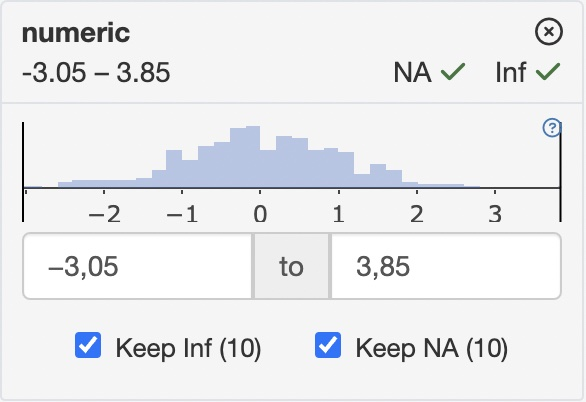
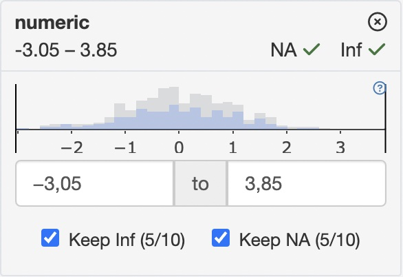

# Filter Panel for Developers

## Filter Panel API

### Getting and setting filter states

All filter panel classes have dedicated methods to set and get the
current filter state. These methods include:

- `get_filter_state` - returns current state of filters as `teal_slices`
  object
- `set_filter_state` - adds or modifies filters based on `teal_slices`
  object
- `remove_filter_state` - removes particular filter states based on
  `teal_slices` object
- `clear_filter_states` - removes all filter states

Setting and getting filter states are done through `teal_slices` object
which is a collection of `teal_slice` objects. Think of a `teal_slice`
as a quantum of information that fully describes the filter state of one
variable.

In order to tell `FilteredData` to set a filter for a specific variable,
one must call the `set_filter_state` method with a `teal_slices` object
containing a `teal_slice` that refers to the variable of interest. To
remove a particular `FilterState` object, one must call the
`remove_filter_state` method using a `teal_slices` containing a
`teal_slice` that refers to the respective variable.

Each `teal_slice` object contains all the information necessary to:

1.  Determine the column in the data set on which to apply the filter
    expression:

    - `dataname` - name of the data set
    - `varname` - name of the column
    - `experiment` (only for `MultiAssayExperiment` objects) - name of
      the experiment
    - `arg` (only for `SummarizedExperiment` objects, e.g within a
      `MultiAssayExperiment`) - name of the argument in the call to
      `subset` (`subset` of `select`)

2.  Express or store the current selection state:

    - `selected` - selected values or limits of the selected range
    - `keep_inf` - determines if `Inf` values should be dropped
    - `keep_na` - determines if `NA` values should be dropped
    - `expr` - explicit logical expression

3.  Control the behavior and appearance of the `FilterState` object:

    - `choices` - determines set of values or range that can be selected
      from
    - `multiple` (only for `ChoiceFilterState`) - allows multiple values
      to be selected
    - `fixed` - forbids changing state of the `FilterState`
    - `anchored` - forbids removing the `FilterState`
    - `title` - displayed title of the filter card

In addition, every `teal_slice` object has an `id`.

It is impossible to create `FilteredData` with slices with duplicated
`id`s. This is because filter states are both created and modified with
the `set_filter_state` method so if two consecutive calls to
`set_filter_state` are passed a `teal_slice` with the same id, the first
call will instantiate a `FilterState`, and the second call will modify
it.

Creating `teal_slices` with slices with duplicated `id`s is forbidden
and will raise an error.

#### 1. Setting the filter state

[`library`](https://rdrr.io/r/base/library.html)`(`[`teal.slice`](https://insightsengineering.github.io/teal.slice/)`)`` `` ``datasets`` ``<-`` `[`init_filtered_data`](https://insightsengineering.github.io/teal.slice/reference/init_filtered_data.md)`(`[`list`](https://rdrr.io/r/base/list.html)`(``iris ``=`` ``iris``, mtcars ``=`` ``mtcars``)``)`` `` `[`set_filter_state`](https://insightsengineering.github.io/teal.slice/reference/filter_state_api.md)`(`` `` datasets ``=`` ``datasets``,`` `` filter ``=`` `[`teal_slices`](https://insightsengineering.github.io/teal.slice/reference/teal_slices.md)`(`` `` `[`teal_slice`](https://insightsengineering.github.io/teal.slice/reference/teal_slice.md)`(``dataname ``=`` ``"iris"``, varname ``=`` ``"Species"``, selected ``=`` ``"virginica"``, keep_na ``=`` ``FALSE``)``,`` `` `[`teal_slice`](https://insightsengineering.github.io/teal.slice/reference/teal_slice.md)`(``dataname ``=`` ``"mtcars"``, id ``=`` ``"4 cyl"``, title ``=`` ``"4 Cylinders"``, expr ``=`` ``"cyl == 4"``)``,`` `` `[`teal_slice`](https://insightsengineering.github.io/teal.slice/reference/teal_slice.md)`(``dataname ``=`` ``"mtcars"``, varname ``=`` ``"mpg"``, selected ``=`` `[`c`](https://rdrr.io/r/base/c.html)`(``20.0``, ``25.0``)``, keep_na ``=`` ``FALSE``, keep_inf ``=`` ``FALSE``)``,`` `` include_varnames ``=`` `[`list`](https://rdrr.io/r/base/list.html)`(``iris ``=`` `[`c`](https://rdrr.io/r/base/c.html)`(``"Species"``, ``"Sepal.Length"``)``)``,`` `` exclude_varnames ``=`` `[`list`](https://rdrr.io/r/base/list.html)`(``mtcars ``=`` ``"cyl"``)`` `` ``)`` ``)`

#### 2. Updating filter states. \*Works only in the `shiny` reactive context.

[`set_filter_state`](https://insightsengineering.github.io/teal.slice/reference/filter_state_api.md)`(`` `` datasets ``=`` ``datasets``,`` `` filter ``=`` `[`teal_slices`](https://insightsengineering.github.io/teal.slice/reference/teal_slices.md)`(`` `` `[`teal_slice`](https://insightsengineering.github.io/teal.slice/reference/teal_slice.md)`(``dataname ``=`` ``"mtcars"``, varname ``=`` ``"mpg"``, selected ``=`` `[`c`](https://rdrr.io/r/base/c.html)`(``22.0``, ``25.0``)``)`` `` ``)`` ``)`

#### 3. Getting the filter state

[`get_filter_state`](https://insightsengineering.github.io/teal.slice/reference/filter_state_api.md)`(``datasets``)`

    ## {
    ##   "slices": [
    ##     {
    ##       "dataname"       : "iris",
    ##       "varname"        : "Species",
    ##       "id"             : "iris Species",
    ##       "choices"        : ["setosa", "versicolor", "virgin...
    ##       "selected"       : ["virginica"],
    ##       "keep_na"        : false,
    ##       "fixed"          : false,
    ##       "anchored"       : false,
    ##       "multiple"       : true
    ##     },
    ##     {
    ##       "dataname"       : "mtcars",
    ##       "id"             : "4 cyl",
    ##       "expr"           : "cyl == 4",
    ##       "fixed"          : true,
    ##       "anchored"       : false,
    ##       "title"          : "4 Cylinders"
    ##     },
    ##     {
    ##       "dataname"       : "mtcars",
    ##       "varname"        : "mpg",
    ##       "id"             : "mtcars mpg",
    ##       "choices"        : [10.4, 34],
    ##       "selected"       : [22, 25],
    ##       "keep_na"        : false,
    ##       "keep_inf"       : false,
    ##       "fixed"          : false,
    ##       "anchored"       : false,
    ##       "multiple"       : true
    ##     }
    ##   ],
    ##   "attributes": {
    ##     "exclude_varnames" : {
    ##       "mtcars"         : "cyl"
    ##     },
    ##     "include_varnames" : {
    ##       "iris"           : ["Species", "Sepal.Length"]
    ##     },
    ##     "count_type"       : "none",
    ##     "allow_add"        : true
    ##   }
    ## }

#### 4. Removing filter states

[`remove_filter_state`](https://insightsengineering.github.io/teal.slice/reference/filter_state_api.md)`(`` `` datasets ``=`` ``datasets``,`` `` filter ``=`` `[`teal_slices`](https://insightsengineering.github.io/teal.slice/reference/teal_slices.md)`(`` `` `[`teal_slice`](https://insightsengineering.github.io/teal.slice/reference/teal_slice.md)`(``dataname ``=`` ``"iris"``, varname ``=`` ``"Species"``)`` `` ``)`` ``)`

#### 5. Clearing the filter state

[`clear_filter_states`](https://insightsengineering.github.io/teal.slice/reference/filter_state_api.md)`(``datasets``)`

### Controlling settings of the filter panel

In addition to controlling individual filter states through
`set_filter_state`, one can also manage some general behaviors of the
whole filter panel. This can be done with arguments of the `teal_slices`
function:

1.  `include_varnames` defines which columns in the used data sets are
    allowed to be filtered on. In the following example only two columns
    of `iris` and two columns of `mtcars` will be able to have filters
    set.

[`set_filter_state`](https://insightsengineering.github.io/teal.slice/reference/filter_state_api.md)`(`` `` ``datasets``,`` `` `[`teal_slices`](https://insightsengineering.github.io/teal.slice/reference/teal_slices.md)`(`` `` include_varnames ``=`` `[`list`](https://rdrr.io/r/base/list.html)`(`` `` iris ``=`` `[`c`](https://rdrr.io/r/base/c.html)`(``"Species"``, ``"Sepal.Length"``)``,`` `` mtcard ``=`` `[`c`](https://rdrr.io/r/base/c.html)`(``"cyl"``, ``"mpg"``)`` `` ``)`` `` ``)`` ``)`

2.  `exclude_varnames` defines which columns in the used data sets are
    **not** allowed to be filtered on. In the following example all
    variables except the four will be available to choose from.

[`set_filter_state`](https://insightsengineering.github.io/teal.slice/reference/filter_state_api.md)`(`` `` ``datasets``,`` `` `[`teal_slices`](https://insightsengineering.github.io/teal.slice/reference/teal_slices.md)`(`` `` exclude_varnames ``=`` `[`list`](https://rdrr.io/r/base/list.html)`(`` `` iris ``=`` `[`c`](https://rdrr.io/r/base/c.html)`(``"Species"``, ``"Sepal.Length"``)``,`` `` mtcard ``=`` `[`c`](https://rdrr.io/r/base/c.html)`(``"cyl"``, ``"mpg"``)`` `` ``)`` `` ``)`` ``)`

3.  `count_type` defines how observation counts are displayed in filter
    cards

| “none” | “all” |
|----|----|
| Distribution in unfiltered data | Filtered vs. unfiltered distribution |
|  |  |

4.  `allow_add` determines whether the “Add Filter Variables” module
    will be displayed to allow the user to add new filters.

## Filter panel as a module

All the instructions herein can be utilized to build a `shiny` app.

[`library`](https://rdrr.io/r/base/library.html)`(`[`shiny`](https://shiny.posit.co/)`)`` `[`library`](https://rdrr.io/r/base/library.html)`(`[`bslib`](https://rstudio.github.io/bslib/)`)`

    ## 
    ## Attaching package: 'bslib'

    ## The following object is masked from 'package:utils':
    ## 
    ##     page

`# initializing FilteredData`` ``datasets`` ``<-`` `[`init_filtered_data`](https://insightsengineering.github.io/teal.slice/reference/init_filtered_data.md)`(`[`list`](https://rdrr.io/r/base/list.html)`(``iris ``=`` ``iris``, mtcars ``=`` ``mtcars``)``)`` `` ``# setting initial filters`` `[`set_filter_state`](https://insightsengineering.github.io/teal.slice/reference/filter_state_api.md)`(`` `` datasets ``=`` ``datasets``,`` `` filter ``=`` `[`teal_slices`](https://insightsengineering.github.io/teal.slice/reference/teal_slices.md)`(`` `` `[`teal_slice`](https://insightsengineering.github.io/teal.slice/reference/teal_slice.md)`(``dataname ``=`` ``"iris"``, varname ``=`` ``"Species"``, selected ``=`` ``"virginica"``, keep_na ``=`` ``FALSE``)``,`` `` `[`teal_slice`](https://insightsengineering.github.io/teal.slice/reference/teal_slice.md)`(``dataname ``=`` ``"mtcars"``, id ``=`` ``"4 cyl"``, title ``=`` ``"4 Cylinders"``, expr ``=`` ``"cyl == 4"``)``,`` `` `[`teal_slice`](https://insightsengineering.github.io/teal.slice/reference/teal_slice.md)`(``dataname ``=`` ``"mtcars"``, varname ``=`` ``"mpg"``, selected ``=`` `[`c`](https://rdrr.io/r/base/c.html)`(``20.0``, ``25.0``)``, keep_na ``=`` ``FALSE``, keep_inf ``=`` ``FALSE``)``,`` `` include_varnames ``=`` `[`list`](https://rdrr.io/r/base/list.html)`(``iris ``=`` `[`c`](https://rdrr.io/r/base/c.html)`(``"Species"``, ``"Sepal.Length"``)``)``,`` `` exclude_varnames ``=`` `[`list`](https://rdrr.io/r/base/list.html)`(``mtcars ``=`` ``"cyl"``)``,`` `` count_type ``=`` ``"all"``,`` `` allow_add ``=`` ``TRUE`` `` ``)`` ``)`` `` ``ui`` ``<-`` ``bslib``::`[`page_fluid`](https://rstudio.github.io/bslib/reference/page.html)`(`` `` ``bslib``::`[`layout_column_wrap`](https://rstudio.github.io/bslib/reference/layout_column_wrap.html)`(`` `` style ``=`` ``htmltools``::`[`css`](https://rstudio.github.io/htmltools/reference/css.html)`(``grid_template_columns ``=`` ``"2fr 1fr"``)``,`` `` ``tags``$``div``(`` `` ``tags``$``div``(`` `` `[`actionButton`](https://rdrr.io/pkg/shiny/man/actionButton.html)`(``"add_species_filter"``, ``"Set iris$Species filter"``)``,`` `` `[`actionButton`](https://rdrr.io/pkg/shiny/man/actionButton.html)`(``"remove_species_filter"``, ``"Remove iris$Species filter"``)``,`` `` `[`actionButton`](https://rdrr.io/pkg/shiny/man/actionButton.html)`(``"remove_all_filters"``, ``"Remove all filters"``)`` `` ``)``,`` `` `[`verbatimTextOutput`](https://rdrr.io/pkg/shiny/man/textOutput.html)`(``"rcode"``)``,`` `` `[`verbatimTextOutput`](https://rdrr.io/pkg/shiny/man/textOutput.html)`(``"filter_state"``)`` `` ``)``,`` `` ``datasets``$``ui_filter_panel``(``"filter_panel"``)`` `` ``)`` ``)`` `` ``server`` ``<-`` ``function``(``input``, ``output``, ``session``)`` ``{`` `` ``# calling filter panel module`` `` ``datasets``$``srv_filter_panel``(``"filter_panel"``)`` `` `` ``# displaying actual filter states`` `` ``output``$``filter_state`` ``<-`` `[`renderPrint`](https://rdrr.io/pkg/shiny/man/renderPrint.html)`(`[`print`](https://rdrr.io/r/base/print.html)`(`[`get_filter_state`](https://insightsengineering.github.io/teal.slice/reference/filter_state_api.md)`(``datasets``)``, trim ``=`` ``FALSE``)``)`` `` `` ``# displaying reproducible filter call`` `` ``output``$``rcode`` ``<-`` `[`renderText`](https://rdrr.io/pkg/shiny/man/renderPrint.html)`(`` `` `[`paste`](https://rdrr.io/r/base/paste.html)`(`` `` `[`sapply`](https://rdrr.io/r/base/lapply.html)`(`[`c`](https://rdrr.io/r/base/c.html)`(``"iris"``, ``"mtcars"``)``, ``datasets``$``get_call``)``,`` `` collapse ``=`` ``"\n"`` `` ``)`` `` ``)`` `` `` ``# programmatic interaction with FilteredData`` `` `[`observeEvent`](https://rdrr.io/pkg/shiny/man/observeEvent.html)`(``input``$``add_species_filter``, ``{`` `` `[`set_filter_state`](https://insightsengineering.github.io/teal.slice/reference/filter_state_api.md)`(`` `` ``datasets``,`` `` `[`teal_slices`](https://insightsengineering.github.io/teal.slice/reference/teal_slices.md)`(`` `` `[`teal_slice`](https://insightsengineering.github.io/teal.slice/reference/teal_slice.md)`(``dataname ``=`` ``"iris"``, varname ``=`` ``"Species"``, selected ``=`` `[`c`](https://rdrr.io/r/base/c.html)`(``"setosa"``, ``"versicolor"``)``)`` `` ``)`` `` ``)`` `` ``}``)`` `` `` ``# programmatic removal of the FilterState`` `` `[`observeEvent`](https://rdrr.io/pkg/shiny/man/observeEvent.html)`(``input``$``remove_species_filter``, ``{`` `` `[`remove_filter_state`](https://insightsengineering.github.io/teal.slice/reference/filter_state_api.md)`(`` `` ``datasets``,`` `` `[`teal_slices`](https://insightsengineering.github.io/teal.slice/reference/teal_slices.md)`(`` `` `[`teal_slice`](https://insightsengineering.github.io/teal.slice/reference/teal_slice.md)`(``dataname ``=`` ``"iris"``, varname ``=`` ``"Species"``)`` `` ``)`` `` ``)`` `` ``}``)`` `` `[`observeEvent`](https://rdrr.io/pkg/shiny/man/observeEvent.html)`(``input``$``remove_all_filters``, `[`clear_filter_states`](https://insightsengineering.github.io/teal.slice/reference/filter_state_api.md)`(``datasets``)``)`` ``}`` `` ``if`` ``(`[`interactive`](https://rdrr.io/r/base/interactive.html)`(``)``)`` ``{`` `` `[`shinyApp`](https://rdrr.io/pkg/shiny/man/shinyApp.html)`(``ui``, ``server``)`` ``}`
