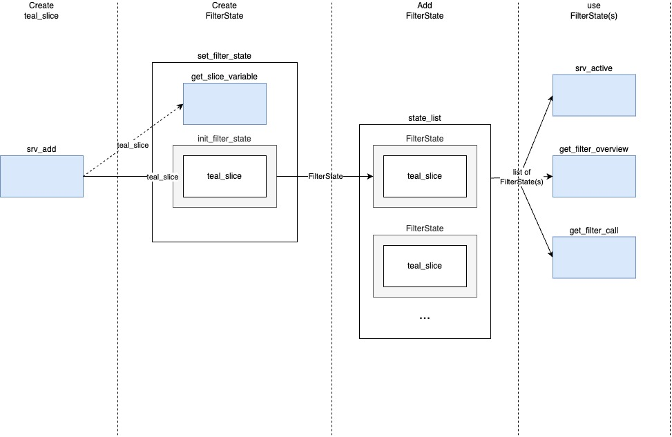

---
title: "Extending Filter Panel"
author: "NEST CoreDev"
output: rmarkdown::html_vignette
vignette: >
  %\VignetteIndexEntry{Extending Filter Panel}
  %\VignetteEngine{knitr::rmarkdown}
  %\VignetteEncoding{UTF-8}
--- 

## Extending filter panel

`teal.slice` offers a way to extend the filter panel with new data types. If you want to add support for a new data 
type you'll need to write a couple of methods for this data type. There are several data specific methods that need to be 
implemented:
- `ui_add` and `srv_add` modules to create a new `teal_slice`.
- `get_slice_variable` extracts the variable from data based on the values in `teal_slice` object. It is necessary to create `FilterState` object after `teal_slice` is created.
- `ui_active` and `srv_active` displays active filters 
- `get_call` returns a filter cann for the data based on the list of `teal_slice` objects.
- `get_filter_overview` returns a summary of the filter

Methods are depicted on a diagram. Methods which could be overridden are marked with blue color. Other methods are 
internal



  

### Use case of `data.frame`s

Let's say we want to add support for `data.frame`s. We will need to implement the following methods:

#### `get_slice_variable`

This method extracts the variable from data based on the values in `teal_slice` object. This is needed to create
`FilterState` object after `teal_slice` is created by `$set_filter_state` method.

```{r}
library(teal.slice)
get_slice_variable.data.frame <- function(data, slice) {
  data[[slice$varname]]
}
```

#### `ui_add` and `srv_add`

When selecting variable in the UI, we need to create a new `teal_slice` object and pass it to the 
`filtered_data$set_filter_state` method. It is important that this `teal_slice` object contain all necessary information
for `get_slice_variable`. In case of objects which have a nested structure, we might need more than just `dataname` and
`varname`.

```{r}
ui_add.data.frame <- function(id, data, dataname) {
  ns <- NS(id)
  tagList(
    teal.widgets::optionalSelectInput(
      inputId = ns("varname"),
      label = dataname,
      choices = names(data),
      selected = NULL,
      multiple = FALSE
    )
  )
}

srv_add.data.frame <- function(id, data, filtered_data, dataname, ...) {
  moduleServer(
    id,
    function(input, output, session) {
      observeEvent(input$varname, ignoreInit = TRUE, {
        filtered_data$set_filter_state(
          teal_slices(
            teal_slice(dataname = dataname, varname = input$varname, ...)
          )
        )
        updateSelectInput(session, "varname", selected = NULL)
      })
    }
  )
}
```


#### `get_call`

This method returns a filter call for the data based on the list of `teal_slice` objects.

```{r}
get_filter_call.data.frame <- function(data, states_list) {
  logger::log_trace("get_filter_call.data.frame")
  dataname <- str2lang(states_list[[1L]]$get_state()$dataname)
  states_predicate <- lapply(states_list, function(state) state$get_call())
  combined_predicate <- calls_combine_by(states_predicate, "&")
  substitute(
    expr = dataname <- subset(dataname, combined_predicate),
    env = list(
      dataname = dataname,
      combined_predicate = combined_predicate
    )
  )
}
```


#### `ui_active` and `srv_active`

These modules display active filter states. `reactive_state_list` contains list of `FilterState` object. Their modules
need to be called when added to a list of states. `remove_state_callback` is a function which is called when a filter
state is removed.


```{r}
ui_active.data.frame <- function(id, data, label = character(0)) {
  logger::log_trace("ui_active.data.frame")
  ns <- NS(id)
  tagList(
    uiOutput(
      ns("cards"),
      class = "accordion",
      `data-label` = ifelse(length(label), paste0("> ", label), ""),
    )
  )
}

srv_active.data.frame <- function(id, data, reactive_state_list, remove_state_callback) {
  moduleServer(
    id,
    function(input, output, session) {
      logger::log_trace("srv_active.default initializing")
      output$filter_count <- renderText({
        sprintf(
          "%d filter%s applied",
          length(reactive_state_list()),
          if (length(reactive_state_list()) != 1) "s" else ""
        )
      })

      current_state <- reactive(reactive_state_list())
      previous_state <- reactiveVal(NULL) # FilterState list
      added_states <- reactiveVal(NULL) # FilterState list

      # gives a valid shiny ns based on a default slice id
      fs_to_shiny_ns <- function(x) {
        checkmate::assert_multi_class(x, c("FilterState", "FilterStateExpr"))
        gsub("[^[:alnum:]]+", "_", get_default_slice_id(x$get_state()))
      }

      observeEvent(current_state(), {
        current_state()
        logger::log_trace("srv_active.data.frame@1 determining added and removed filter states")
        # Be aware this returns a list because `current_state` is a list and not `teal_slices`.
        new_states <- setdiff_teal_slices(current_state(), previous_state())
        if (length(new_states) > 0L) {
          added_states(new_states)
        }

        previous_state(current_state())
        NULL
      })

      output[["cards"]] <- shiny::renderUI({
        logger::log_trace("srv_active.data.frame@2 rendering filter cards")
        lapply(
          current_state(), # observes only if added/removed
          function(state) {
            shiny::isolate( # isolates when existing state changes
              state$ui(id = session$ns(fs_to_shiny_ns(state)), parent_id = session$ns("cards"))
            )
          }
        )
      })

      observeEvent(
        added_states(), # we want to call FilterState module only once when it's added
        ignoreNULL = TRUE,
        {
          added_state_names <- vapply(added_states(), function(x) x$get_state()$id, character(1L))
          logger::log_trace("srv_active_array@2 triggered by added states: { toString(added_state_names) }")
          lapply(added_states(), function(state) {
            fs_callback <- state$server(id = fs_to_shiny_ns(state))
            observeEvent(
              once = TRUE, # remove button can be called once, should be destroyed afterwards
              ignoreInit = TRUE, # ignoreInit: should not matter because we destroy the previous input set of the UI
              eventExpr = fs_callback(), # when remove button is clicked in the FilterState ui
              handlerExpr = remove_state_callback(teal_slices(state$get_state()))
            )
          })
          added_states(NULL)
        }
      )
    }
  )
}
```

#### `get_filter_overview`

This method returns a summary of the filter. Method should return `data.frame` with columns `dataname`, `obs` and
`obs_filtered`.

```{r}
get_filter_overview.data.frame <- function(data_unfiltered, data_filtered, dataname) {
  logger::log_trace("get_filter_overview.data.frame")
  data.frame(
    dataname = dataname,
    obs = nrow(data_unfiltered),
    obs_filtered = nrow(data_filtered)
  )
}
```


#### Example app

Putting it all together, we can create an app which uses `mtcars` and `iris` data sets. Methods created above will
override defaults from `teal.slice`.

```{r}
library(shiny)

# initializing FilteredData
datasets <- init_filtered_data()
datasets$set_dataset("iris", iris)
datasets$set_dataset("mtcars", mtcars)

# setting initial filters
set_filter_state(
  datasets = datasets,
  filter = teal_slices(
    teal_slice(dataname = "iris", varname = "Species", selected = "virginica", keep_na = FALSE),
    teal_slice(dataname = "mtcars", id = "4 cyl", title = "4 Cylinders", expr = "cyl == 4"),
    teal_slice(dataname = "mtcars", varname = "mpg", selected = c(20.0, 25.0), keep_na = FALSE, keep_inf = FALSE),
    include_varnames = list(iris = c("Species", "Sepal.Length")),
    exclude_varnames = list(mtcars = "cyl"),
    count_type = "all",
    allow_add = TRUE
  )
)

app <- shinyApp(
  ui = fluidPage(
    shinyjs::useShinyjs(),
    fluidRow(
      column(
        width = 9,
        id = "teal_primary_col",
        shiny::tagList(
          actionButton("add_species_filter", "Set iris$Species filter"),
          actionButton("remove_species_filter", "Remove iris$Species filter"),
          actionButton("remove_all_filters", "Remove all filters"),
          verbatimTextOutput("rcode"),
          verbatimTextOutput("filter_state")
        )
      ),
      column(
        width = 3,
        id = "teal_secondary_col",
        ui_filter_panel("filter_panel")
      )
    )
  ),
  server = function(input, output, session) {
    # calling filter panel module
    srv_filter_panel("filter_panel", datasets)

    # displaying actual filter states
    output$filter_state <- renderPrint(print(get_filter_state(datasets), trim = FALSE))

    # displaying reproducible filter call
    output$rcode <- renderText(
      paste(
        sapply(c("iris", "mtcars"), datasets$get_call),
        collapse = "\n"
      )
    )

    # programmatic interaction with FilteredData
    observeEvent(input$add_species_filter, {
      set_filter_state(
        datasets,
        teal_slices(
          teal_slice(dataname = "iris", varname = "Species", selected = c("setosa", "versicolor"))
        )
      )
    })

    # programmatic removal of the FilterState
    observeEvent(input$remove_species_filter, {
      remove_filter_state(
        datasets,
        teal_slices(
          teal_slice(dataname = "iris", varname = "Species")
        )
      )
    })
    observeEvent(input$remove_all_filters, clear_filter_states(datasets))
  }
)
if (interactive()) {
  app
}
```