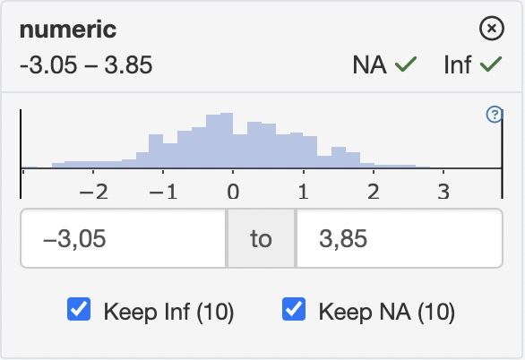

## Filter Panel API

### Getting and setting filter states

All filter panel classes have dedicated methods to set and get current filter state.
These methods include:

- `get_filter_state` - returns the current state of filters in form of `teal_slices` object
- `set_filter_state` - adds or modifies the filters based on `teal_slices` object
- `remove_filter_state` - removes particular filter states based on `teal_slices` object
- `clear_filter_states` - removes all filter states

Setting and getting filter states are done through `teal_slices` object which is a collection of `teal_slice` objects.
Think of a `teal_slice` as a quantum of information that fully describes the filter state of one variable.

In order to tell `FilteredData` to set a filter for a specific variable,
one must call the `set_filter_state` method with a `teal_slices` object containing a `teal_slice`
that refers to the variable of interest.
To remove a particular `FilterState` object, one must call the `remove_filter_state` method
using a `teal_slices` containing a `teal_slice` that refers to the respective variable.

Each `teal_slice` object contains all the information necessary to:

1. Determine the column in the data set on which to apply the filter expression:

   - `dataname` - name of the data set
   - `varname` - name of the column
   - `...` - (see [Extending filter panel](#extending-filter-panel)) additional arguments which can determine location 
    of the column in the data set. 
      

2. Express or store the current selection state:

   - `selected` - selected values or limits of the selected range
   - `keep_inf` - determines if `Inf` values should be dropped
   - `keep_na` - determines if `NA` values should be dropped
   - `expr` - explicit logical expression

3. Control the behavior and appearance of the `FilterState` object:

   - `choices` - determines the set of values or the range that can be selected from
   - `multiple` (only for `ChoiceFilterState`) - allows multiple values to be selected
   - `fixed` - forbids changing state of the `FilterState`
   - `anchored` - forbids removal of the `FilterState`
   - `title` - displayed title of the filter card

In addition, every `teal_slice` object has an `id`.

It is impossible to create `FilteredData` with slices with duplicated `id`s.
This is because filter states are both created and modified with the `set_filter_state` method
so if two consecutive calls to `set_filter_state` are passed a `teal_slice` with the same id,
the first call will instantiate a `FilterState`, and the second call will modify it.

Creating `teal_slices` with slices with duplicated `id`s is forbidden and will raise an error.


#### 1. Setting the filter state
```{r, message=FALSE, warning=FALSE}
library(teal.slice)

datasets <- init_filtered_data()
datasets$set_dataset("iris", iris)
datasets$set_dataset("mtcars", mtcars)

set_filter_state(
  datasets = datasets,
  filter = teal_slices(
    teal_slice(dataname = "iris", varname = "Species", selected = "virginica", keep_na = FALSE),
    teal_slice(dataname = "mtcars", id = "4 cyl", title = "4 Cylinders", expr = "cyl == 4"),
    teal_slice(dataname = "mtcars", varname = "mpg", selected = c(20.0, 25.0), keep_na = FALSE, keep_inf = FALSE),
    include_varnames = list(iris = c("Species", "Sepal.Length")),
    exclude_varnames = list(mtcars = "cyl")
  )
)
```

#### 2. Updating filter states. *Works only in the shiny reactive context.
```{r, message=FALSE, warning=FALSE}
set_filter_state(
  datasets = datasets,
  filter = teal_slices(
    teal_slice(dataname = "mtcars", varname = "mpg", selected = c(22.0, 25.0))
  )
)
```

#### 3. Getting the filter state
```{r, message=FALSE, warning=FALSE}
get_filter_state(datasets)
```

#### 4. Removing filter states
```{r, message=FALSE, warning=FALSE}
remove_filter_state(
  datasets = datasets,
  filter = teal_slices(
    teal_slice(dataname = "iris", varname = "Species")
  )
)
```

#### 5. Clearing the filter state
```{r, message=FALSE, warning=FALSE}
clear_filter_states(datasets)
```

### Controlling settings of the filter panel

In addition to controlling individual filter states through `set_filter_state`,
one can also manage some general behaviors of the whole filter panel.
This can be done with arguments of the `teal_slices` function:

1. `include_varnames` defines which columns in the used data sets are allowed to be filtered on.
In the following example only two columns of `iris` and two columns of `mtcars` will be able to have filters set.
```{r}
set_filter_state(
  datasets,
  teal_slices(
    include_varnames = list(
      iris = c("Species", "Sepal.Length"),
      mtcard = c("cyl", "mpg")
    )
  )
)
```

2. `exclude_varnames` defines which columns in the used data sets are **not** allowed to be filtered on.
In following example all variables except the four will be available to choose from.
```{r}
set_filter_state(
  datasets,
  teal_slices(
    exclude_varnames = list(
      iris = c("Species", "Sepal.Length"),
      mtcard = c("cyl", "mpg")
    )
  )
)
```

3. `count_type` defines how observations counts displayed in filter cards

| "none" | "all" |
|--------|-------|
| Distribution in unfiltered data | Filtered vs. unfiltered distribution  |
| {width=300} | {width=300} |

4. `allow_add` determines whether the "Add Filter Variables" module will be displayed
to allow the user to add new filters.


## Filter panel as a module

All the instructions herein can be utilized to build a shiny app.

```{r}
library(shiny)

# initializing FilteredData
datasets <- init_filtered_data()
datasets$set_dataset("iris", iris)
datasets$set_dataset("mtcars", mtcars)

# setting initial filters
set_filter_state(
  datasets = datasets,
  filter = teal_slices(
    teal_slice(dataname = "iris", varname = "Species", selected = "virginica", keep_na = FALSE),
    teal_slice(dataname = "mtcars", id = "4 cyl", title = "4 Cylinders", expr = "cyl == 4"),
    teal_slice(dataname = "mtcars", varname = "mpg", selected = c(20.0, 25.0), keep_na = FALSE, keep_inf = FALSE),
    include_varnames = list(iris = c("Species", "Sepal.Length")),
    exclude_varnames = list(mtcars = "cyl"),
    count_type = "all",
    allow_add = TRUE
  )
)

app <- shinyApp(
  ui = fluidPage(
    shinyjs::useShinyjs(),
    fluidRow(
      column(
        width = 9,
        id = "teal_primary_col",
        shiny::tagList(
          actionButton("add_species_filter", "Set iris$Species filter"),
          actionButton("remove_species_filter", "Remove iris$Species filter"),
          actionButton("remove_all_filters", "Remove all filters"),
          verbatimTextOutput("rcode"),
          verbatimTextOutput("filter_state")
        )
      ),
      column(
        width = 3,
        id = "teal_secondary_col",
        ui_filter_panel("filter_panel")
      )
    )
  ),
  server = function(input, output, session) {
    # calling filter panel module
    srv_filter_panel("filter_panel", datasets)

    # displaying actual filter states
    output$filter_state <- renderPrint(print(get_filter_state(datasets), trim = FALSE))

    # displaying reproducible filter call
    output$rcode <- renderText(
      paste(
        sapply(c("iris", "mtcars"), datasets$get_call),
        collapse = "\n"
      )
    )

    # programmatic interaction with FilteredData
    observeEvent(input$add_species_filter, {
      set_filter_state(
        datasets,
        teal_slices(
          teal_slice(dataname = "iris", varname = "Species", selected = c("setosa", "versicolor"))
        )
      )
    })

    # programmatic removal of the FilterState
    observeEvent(input$remove_species_filter, {
      remove_filter_state(
        datasets,
        teal_slices(
          teal_slice(dataname = "iris", varname = "Species")
        )
      )
    })
    observeEvent(input$remove_all_filters, clear_filter_states(datasets))
  }
)
if (interactive()) {
  app
}
```


## Extending filter panel

`teal.slice` offers a way to extend the filter panel with new data types. If you want to add support for a new data 
type you'll need to write a couple of methods for this data type. There are several data specific methods that need to be 
implemented:
- `ui_add` and `srv_add` modules to create a new `teal_slice`.
- `get_slice_variable` extracts the variable from data based on the values in `teal_slice` object. It is necessary to create `FilterState` object after `teal_slice` is created.
- `ui_active` and `srv_active` displays active filters 
- `get_call` returns a filter cann for the data based on the list of `teal_slice` objects.
- `get_filter_overview` returns a summary of the filter

Methods are depicted on a diagram. Methods which could be overridden are marked with blue color. Other methods are 
internal


  

### Use case of `data.frame`s

Let's say we want to add support for `data.frame`s. We will need to implement the following methods:

#### `get_slice_variable`

This method extracts the variable from data based on the values in `teal_slice` object. 
```{r}
get_slice_variable.teal_slice.data.frame <- function(x, data) {
  data[[x$varname]]
}
```

#### `ui_add` and `srv_add`

When selecting variable in the UI, we need to create a new `teal_slice` object and pass it to the 
`filtered_data$set_filter_state` method.

```{r}
ui_add.data.frame <- function(id, data, dataname) {
  ns <- NS(id)
  tagList(
    selectInput(
      inputId = ns("varname"),
      label = "Variable",
      choices = names(choices),
      selected = names(choices)[1]
    )
  )
}

srv_add.teal_slice.data.frame <- function(id, data, filtered_data, dataname, ...) {
  moduleServer(
    id,
    function(input, output, session) {
      observeEvent(input$varname, {
        filtered_data$set_filter_state(
          teal_slices(
            teal_slice(dataname = dataname, varname = input$varname)
          )
        )
      })
    }
  )
}
```


#### `get_call`

This method returns a filter call for the data based on the list of `teal_slice` objects.
```{r}
get_filter_call.teal_slice.data.frame <- function(data, states_list) {
  states_predicate <- lapply(states_list, function(state) state$get_call())
  combined_predicate <- calls_combine_by(states_predicate, "&")
  substitute(
    expr = dataname <- subset(dataname, combined_predicate),
    env = list(
      dataname = str2lang(states_list[[1L]]$get_state()$dataname),
      combined_predicate = combined_predicate
    )
  )
}
```


#### `ui_active` and `srv_active`

These modules display active filters. 
```{r}
ui_active.data.frame <- function(id, data, label = character(0)) {
  ns <- NS(id)
  # ...
}

srv_active.data.frame <- function(id, data, reactive_state_list, remove_state_callback) {
  moduleServer(
    id,
    function(input, output, session) {
      # ...
    }
  )
}
```

#### `get_filter_overview`

This method returns a summary of the filter.
```{r}
get_filter_overview.data.frame <- function(x, data) {

}
```
