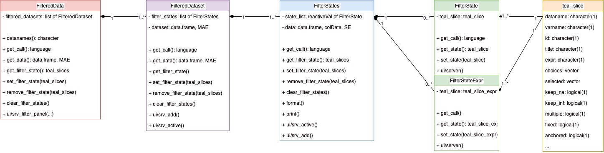
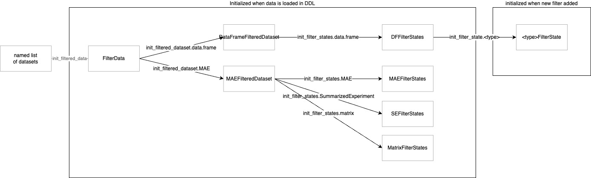
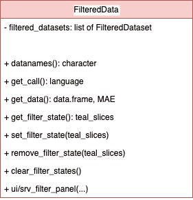
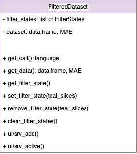
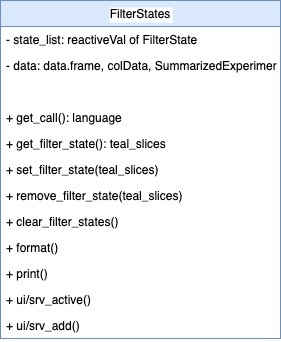
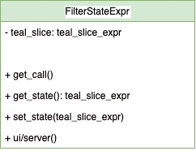
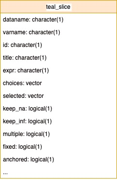
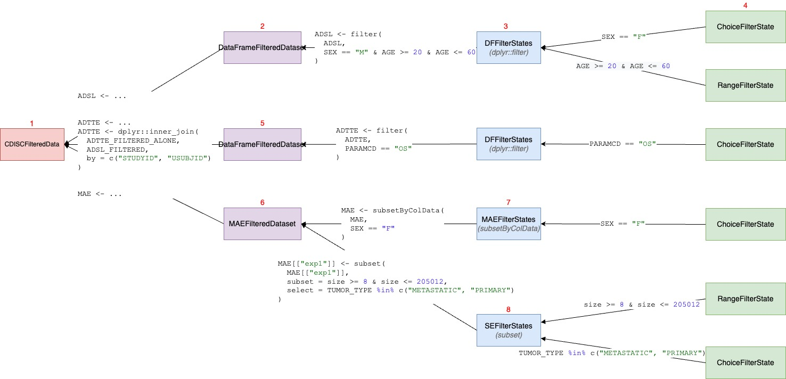
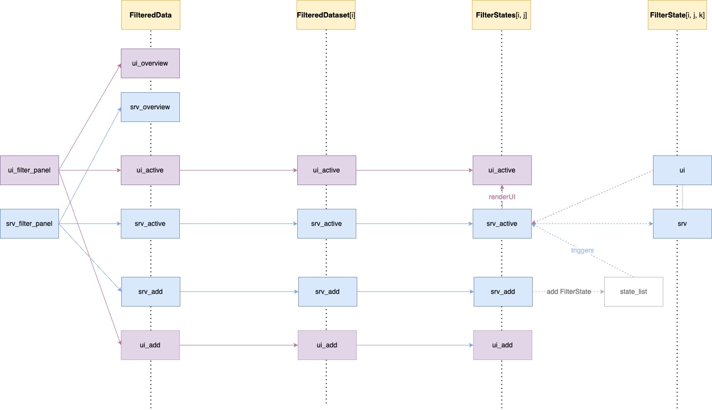

This vignette provides a deep dive into the design of the `teal.slice` package.
It is intended for advanced developers.
If you want to merely use `teal.slice`, the *Filter panel for developers* vignette should satisfy all your needs.


## Introduction

The `teal.slice` package is composed of multiple classes, whose primary purpose is to provide a `shiny` module for managing and displaying filters.
The top class in the structure is `FilteredData`.
Other modules in the app can interact with `FilteredData` to make filter calls and obtain filtered data.

```{r echo=FALSE, out.width='100%'}

```

The `FilteredData` object contains one or more `FilteredDataset` objects.
While `FilteredData` manages the entire filter panel, each `FilteredDataset` is responsible for filtering a single data set.
`FilteredDataset` contains one or more `FilterStates` objects, each corresponding to one data structure like a `data.frame`, a `SummarizedExperiment`, or a `MultiAssayExperiment`.
`FilterStates` holds a collection of `FilterState` objects, each representing a single filter condition applied on one variable.

`FilterStates` can also hold `FilterStateExpr` objects.
This is a variation of `FilterStates` that focuses on the filter expression regardless of the underlying data.
The expression can refer to one or several variables.

`FilteredData`, `FilteredDataset`, `FilterStates`, and `FilterState`/`FilterStateExpr` are all `R6` class objects. Those objects form a hierarchy, but there is no inheritance between them.

Each `FilterState`/`FilterStateExpr` object contains one `teal_slice` object.
`teal_slice` stores all information necessary to define a filter.
It is not an `R6` class. It does not have behaviors and does not produce any `shiny` modules.
Its sole purpose is to store filter information.


## Initialization

```{r echo=FALSE, out.width='100%'}

```


As part of the `teal` workflow, `FilteredData`, `FilteredDataset`, and `FilterStates` are created instantly when the data is loaded and remain unchanged. 
One `FilteredData` object is initialized on `TealData`. 
A `FilteredDataset` is initialized for each data set. One or more `FilterStates` are initialized, depending on the type of data set.

On the other hand, a `FilterState` is initialized each time a new filter is added. 
The values of the `FilterState` can be changed, and it can also be removed and added again.

The key mechanism in the new filter panel is in `FilterStates` class. 
One can think of `FilterStates` as an equivalent to a single, possibly compound, subset call made on one data structure. 
While `FilterState` represents a logical predicate on one vector, e.g `SEX == "F"`, `FilterStates` will compose all predicates of its member `FilterState` objects into a call to a subsetting function, e.g. `data <- subset(data, SEX == "F" & RACE == "CAUCASIAN")`.

In the case of a `data.frame`, a single `dplyr::filter` call is sufficient to subset the whole data set, however, a `MultiAssayExperiment` contains patient data in the `@colData` slot and multiple experiments in the `@ExperimentList` slot, and all of these objects have to be filtered by separate subsetting calls. 
Therefore, subclasses of `FilterStates` exist to handle different kinds of data structures and they use different subsetting functions.


## Class Description

This section provides a detailed description of all class that make up the filter panel structure.

### `FilteredData`

```{r echo=FALSE, out.width='33%'}

```

`FilteredData` is an object responsible for managing the filter panel. 
It sits on top of the class structure and handles the shiny modules of the sub-classes.

`FilteredData` provides several API methods that can be used to access reproducible subsetting calls and the resulting filtered data. 
It also allows external modules to manage filter states through functions such as `get_filter_state`, `set_filter_state`, `remove_filter_state`, and `clear_filter_state`.

### `FilteredDataset`

```{r echo=FALSE, out.width='33%'}

```

`FilteredDataset` is a class that keeps unfiltered data and returns filtered data based on the filter call derived from the contained `FilterStates`. 
`FilteredDataset` class objects are initialized by `FilteredData`, one for each data set. 
`FilteredDataset` contains a single `TealDataset` object and one-to-many `FilterStates` depending on the type of that object.
`FilteredDataset` stores data set attributes, joins keys to other data sets, and also combines and executes the subsetting calls taken from `FilterStates`.

The following `FilteredDataset` child classes are currently implemented:

- `DefaultFilteredDataset` for `data.frame`.
- `MAEFilteredDataset` for `MultiAssayExperiment`.

### `FilterStates`

```{r echo=FALSE, out.width='33%'}

```

When the app starts, `FilteredDataset` initializes one or more `FilterStates` objects, one for each component of the underlying data set. Every `FilterStates` object is responsible for making one subset call. 
For example, a `MAEFilteredDataset` will create one `FilterStates` for its `colData` and one `FilterStates` for each of its experiments. 
Every `FilterStates` will return a separate subsetting call, which will be used to subset the entire `MultiAssayExperiment`

The following `FilteredDataset` child classes are currently implemented:

- `DFFilterStates` for `data.frame`; uses `dplyr::filter` to filter on columns.
- `MAEFilterStates` for`MultiAssayExperiment`; uses `MultiAssayExperiment::subsetByColData` to filter on columns of the `DataFrame` in the `@colData` slot.
- `SEFilterStates` for `SummarizedExperiment`; uses the `subset` method for `SummarizedExperiment` to filter on columns of `DataFrames` in the `@colData` and `@rowData` slots. 
- `MatrixFilterStates` for `matrix`; uses the `[` operator to filter on columns.

`FilterStates` serves two `shiny`-related purposes:

- `ui/srv_add` allows adding a `FilterState` for a selected variable. The variables included in the module are the filterable column names of the provided data set. Selecting a variable adds a `FilterState` to the `reactiveVal` stored in the `private$state_list` private field. The subtype of the created `FilterState` automatically determined based on the class of the selected column.

- `ui/srv_active` displays cards of the currently existing `FilterState` objects. Every `FilterState` object serves a remove button and `FilterStates` and reacts to clicking that button by removing the respective`FilterState` from `private$state_list` and destroying it's observers. `ui/srv_active` also contains a remove button that removes all `FilterState` objects within this `FilterStates`.

### `FilterState`

```{r echo=FALSE, out.width='33%'}
knitr::include_graphics("./images/filter_panel/class_details_filter_state.jpg")
```

This class controls a single filter card and returns a condition call that depends on the selection state. 
A `FilterState` is initialized each time `FilterStates` adds a new filter. 
Different classes of data require different handling of choices so several `FilterState` subclasses exist and each of them presents a different user interface and generates a different subsetting call. 
A `FilterState` is created as follows:

1. `FilterStates` creates `teal_slice` with `dataname` based on the parent data set and `varname` based on the selected variable
2. the `teal_slice` is wrapped in `teal_slices` and passed to `FilterStates$set_filter_state`
3. `FilterStates$set_filter_state_impl` is calls
4. `FilterStates$set_filter_state_impl` calls `init_filter_state`, passing the appropriate variable as `x`
5. `init_filter_states` is a generic function that dispatches `x`, `teal_slice` and other arguments to the respective child class constructor:

- `LogicalFilterState` for `logical` variables. Presents a checkbox group. Call example: `!variable`.
- `RangeFilterState` for `numeric` variables. Presents an interactive plot as well as two numeric inputs. Selection is always two values that represent inclusive interval limits. Call example: `variable >= selection[1] & variable <= selection[2]`
- `DateFilterState` for `Date` variables. Presents two date inputs. Selection is two values that determine inclusive interval limits. Call example: `variable >= selection[1] & variable <= selection[2]`.
- `DatetimeFilterState` for `POSIXct` and `POSIXlt` variables. Similar to `DateFilterState`.
- `ChoicesFilterState` for `character` and `factor` values. Additionally, all classes will be passed to `ChoicesFilterState` if their number of unique values is lower than that in `getOption("teal.threshold_slider_vs_checkboxgroup")`. Presents either a checkbox group or a drop-down menu. Depending on settings, allows either only one or any number of values to be selected. Call examples: `variable == selection`, `variable %in% selection`.
- `EmptyFilterState` for variables that contain only missing values. Does not return calls.

All child classes handle missing values, and `RangedFilterState` also handles infinite values.

The `FilterState` constructor also takes the `extract_type` argument, which determines how the call is constructed `extract_type` can be unspecified, `"matrix"` or `"list"` and its value corresponds to the type of the variable prefix in the returned condition call. If `extract_type` is `"list"`, the variable in the condition call is `<dataname>$<varname>`, for `"matrix"` it would be `<dataname>[, "<varname>"]`.

### `FilterStateExpr`

```{r echo=FALSE, out.width='33%'}

```

Similarly to `FilterState`, `FilterStateExpr` controls a single filter card and returns logical expression. 
However, while `FilterState` generates the call based on the selection state, in `FilterStateExpr` the call must be specified manually and it must be a valid R expression.

### `teal_slice`

```{r echo=FALSE, out.width='33%'}

```


`teal_slice` is a simple object for storing filter information. 
It can be thought of as a quantum of information. 
A `teal_slice` object is passed directly to `FilterState$initialize` and is stored inside of the `FilterState` to keep the current state of the filter. 
Technically, all values used used to generate a call are in `teal_slice`. 
`FilterState` can be described as a wrapper around `teal_slice` that provides additional methods to handle filter state. 
It also contains the actual data (a single column).

While `teal_slice` is not an `R6` object and does not encode any behaviors, it is implemented around a `reactiveValues` object to allow shared state in advanced `teal` applications.

See `?teal_slice` for a detailed explanation.


## Making a reproducible filter call

### Overview

```{r echo=FALSE, out.width='100%'}
knitr::include_graphics("./images/filter_panel/get_call_overview.jpg")
```

The diagram above presents the filter panel classes and their responsibilities when composing filter calls. 
Code is generated by nested execution of `get_call` methods. 

`FilteredData$get_call` calls `FilteredDataset$get_call`, which calls `FilterStates$get_call` which in turn calls `FilterState$get_call`. 

`FilterState$get_call()` returns a single subsetting expression (logical predicate).

`FilterStates$get_call()` returns a single complete subsetting call by extracting expressions from all `FilterState` objects and combining them with the `&` operator. 

`FilteredDataset$get_call()` returns a list of calls extracted from all `FilterStates` objects.

`FilteredData$get_call(<dataname>)` returns a list of calls extracted from the specified `FilteredDataset`.

### Example

```{r echo=FALSE, out.width='100%'}

```

Calling `datasets$get_call(<dataname>)` in `teal` modules executes a chain of calls in all filter panel classes. 
Consider the following scenario:

(1) `FilteredData` contains three data sets: `ADSL`, `ADTTE`, `MAE`, each stored in its own `FiteredDataset` object

(2) `ADSL` is a `data.frame` so it can be filtered with a single `dplyr::filter` call. This data set is stored in `DefaultFilteredDataset`, which holds a single `FilterStates` object.

(3) `FilterStates` constructs a `dplyr::filter` call based on the `FilterState` objects present in its `private$state_list`.

(4) When `FilterStates$set_filter_state` adds a new `teal_slice`, a `FilterState` is created and added to `private$state_list` in `FilterStates`.
`FilterStates` gathers logical expressions from all of its `FilterState` objects and composes them into a `dplyr::filter(ADSL, ...)` call.

(5) Two new filters have been added: `SEX` and `AGE`. This causes initialization of appropriate `FilterState` subclasses: `ChoiceFilterState` and `RangeFilterState`. 
Each `FilterState` produces a subsetting expression: `SEX == "F"` and `AGE >= 20 & AGE <= 60`.
The expressions are combined with `&` and passed to `dplyr::filter`, producing `ADSL <- dplyr::filter(ADSL, SEX == "F" & AGE >= 20 & AGE <= 60)`. `DefaultFilteredDataset` puts this call in a list and returns it to `FilteredData`.

(6) `ADTTE` is also a `data.frame` so the `FilteredDataset` that stores it works much the same as the one for `ADSL`. 
The one difference is that the `dplyr::filter` call for `ADTTE` is followed by an `dplyr::inner_join` call to merge the filtering result with the parent data set (`ADSL`) so that key columns remain consistent. 
Note that this only done when `join_keys` is specified - otherwise `ADTTE` would be treated as a separate data set and filtered independently.

(7) The `MAE` data set is a `MultiAssayExperiment`, which contains multiple sub-objects which can be filtered on. 
One of them is `ADSL`-like patient data, stored as a `DataFrame` in `MAE@colData`, and others are experiments, typically `SummarizedExperiment` objects, stored in `MAE@ExperimentList`, which can be extracted using `MAE[["experiment name"]]`. 
Therefore, `FilteredDatasetMAE` has multiple `FilterStates` objects: one for subject data and one for each experiment.

(7) A `MAEFilterStates` object is initialized for subject data and for this object `MultiAssayExperiment::subsetByColData` function is applied. 
`MultiAssayExperiment::subsetByColData` has two arguments: `x` (data) and `y` (conditions). 
Since all filter expressions are passed to one argument, `MAEFilterStates` only has one `state_list`, just like `DFFilterStates`. 
Adding new filters triggers the same actions as described in (4).

(8) A `SummarizedExperiment` is more complicated as observations can be filtered based on its `rowData` and `colData` slots, both contain `DataFrame`s.
Subsetting is done by a dedicated S4 `subset` method, which takes two key arguments: `subset` takes logical expressions that will be applied to `rowData` and `select` takes logical expressions that will be applied to `colData`.
`teal_slice` objects that specify filters in a `SummarizedExperiment` must contain an `arg` element, either `"subset"` or `"select"`, to reflect which slot of the experiment they refer to.
The `SEFilterStates` gathers logical expressions its member `FilterState` objects, groups them by the `arg` element, and builds a call so `subset` with two combined logical expressions passed to the `subset` and `select` arguments.


## Filter panel modules 

The `FilteredData` object uses the `filter_panel_ui` and `filter_panel_srv` methods to put up a filter panel that can be used in any application. 
In `teal` applications it will be placed on the right hand side.
The filter panel module does not return anything. 
Data, subsetting calls and filter states are accessible by specific public methods: `get_data`, `get_call`, and `get_filter_state`, respectively. 
Typically, the filter panel consists of three modules: 

- `ui/srv_overview` displays observation counts filtered vs unfiltered data
- `ui/srv_active` displays active filter cards, which are created by `FilterState` objects
- `ui/srv_add` allows for adding filters

`FilteredData` does not handle data sets directly because they may be of different types, rather, it calls
respective methods in lower level classes. 

When a new filter is added using the "Add Filter Variable" module in `FilterStates`, a new `FilterState` object is initialized and added to `private$state_list`.
`FilterStates$srv_active` observes `private$state_list` (which is a `reactiveVal`) and when the state of the list changes (a filter is added added or removed), it calls `FilterState$server` and uses `renderUI` to display `FilterState$ui`.

```{r echo=FALSE, out.width='33%'}

```

