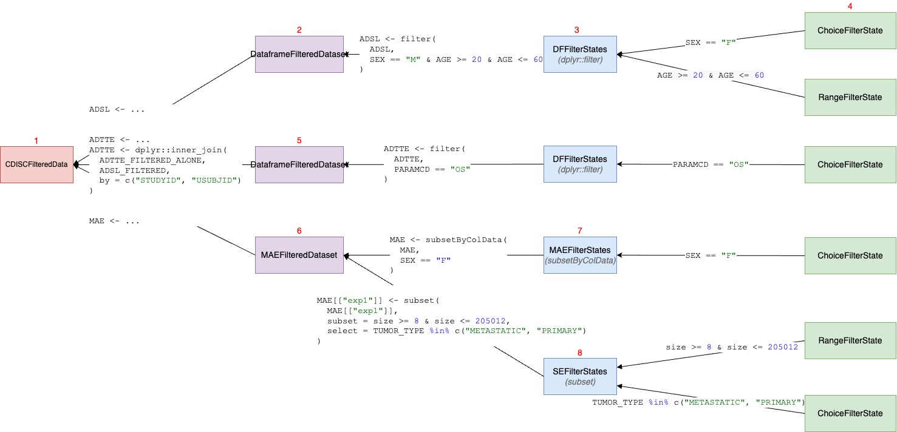

This vignette is dedicated to everyone who is interested in the design of `teal_slice`. This document is for very 
advanced developers. If you want to use `teal.slice` as is, we recommend to delve into *Filter panel for developers*
vignette.

## Overview

The `teal.slice` package is composed of multiple class objects that serve the main purpose of providing a shiny module. This module is responsible for displaying and managing filters. At the top of the class structure is the `FilteredData` class, which other modules can utilize to obtain filtered data and make filter calls.


```{r echo=FALSE, out.width='100%'}
knitr::include_graphics("./images/filter_panel/filter_panel_uml_all.jpg")
```


The `FilteredData` class contains one-to-many `FilteredDataset` objects. While `FilteredData` manages the entire filter panel, each `FilteredDataset` is responsible for filtering a single dataset. Depending on the variant of `FilteredDataset`, it can contain one or many `FilterStates`. 

`FilterStates` is a collection of `FilterState` objects. `FilterState` represents a single filter condition applied on a column (`FilterState`) or on one-to-many variables (`FilterStateExpr`). Each `FilterState` object contains a `teal_slice` object, which is a `reactiveValue` and stores all the necessary information to define a filter. 

Unlike other classes, the `teal_slice` object does not have any methods or shiny modules. Its sole purpose is to store filter information.

## Initialization

```{r echo=FALSE, out.width='100%'}
knitr::include_graphics("./images/filter_panel/filtered_data_init.jpg")
```

As part of the teal workflow, the `FilteredData` class is initialized on `TealData`. All datasets from `TealData` are passed to `FilteredData`, and for each dataset, a `FilteredDataset` is initialized. The specific type of `FilteredDataset` depends on the type of dataset being used. For a `data.frame `object, a `DefaultFilteredDataset` is initialized, while for a `MultiAssayExperiment` object, an `MAEFilteredDataset` is initialized.

The key mechanism in the new filter panel is in `FilterStates` class. `FilterStates` are initialized within `FilteredDataset`. The type and number of `FilterStates` depend on the dataset stored in the `FilteredDataset`. One can think of `FilterStates` as equivalent to a single subset call. In the case of a `data.frame` (`DFFilteredDataset`), a single `dplyr::filter call` is sufficient to subset the rows. However, in the case of a `MultiAssayExperiment` object, which contains patient data in the `@colData` slot and multiple experiments in the `@ExperimentList` slot, multiple `FilterStates` objects are required for `MAEFilteredDataset`. This is because each object within the `MultiAssayExperiment` needs to be filtered separately.

The described objects are created instantly when the data is loaded and remain unchanged. On the other hand, a `FilterState` is initialized each time a new filter is added. The values of the `FilterState` can be changed, and it can also be removed and added again.

## Classes description

This section describes in detail each class managing filter panel.

### `FilteredData`

```{r echo=FALSE, out.width='33%'}

```

`FilteredData` is an object responsible for managing the filter panel. It sits on top of the class structure and handles the shiny modules of the sub-classes.

`FilteredData` provides several API methods that can be used to access filtered data and their reproducible calls. It also allows external modules to manage filter states through methods such as `get_filter_state`, `set_filter_state`, `remove_filter_state`, and `clear_filter_state`.

### `FilteredDataset`

```{r echo=FALSE, out.width='33%'}
knitr::include_graphics("./images/filter_panel/class_details_filtered_dataset.jpg")
```

`FilteredDataset` is a class which keeps unfiltered data and returns filtered data based on the filter call derived from `FilterStates`. `FilteredDataset` class objects are initialized by `FilteredData`, one for each dataset. `FilteredDataset` contains a single `TealDataset` object and one-to-many `FilterStates` depending on the type of object. `FilteredDataset` stores dataset attributes, joins keys to other datasets, and also combines and executes the code taken from `FilterStates`.

Following `FilteredDataset` derived classes are already implemented:

- `DefaultFilteredDataset` dispatched by `data.frame`.
- `MAEFilteredDataset` dispatched by `MultiAssayExperiment`.

### `FilterStates`

```{r echo=FALSE, out.width='33%'}
knitr::include_graphics("./images/filter_panel/class_details_filter_states.jpg")
```

`FilterStates` are initialized by the `FilteredDataset` when the teal app starts. The type and number of `FilterStates` depend on the type of object being part of `FilteredDataset`. If the dataset in `FilteredDataset` is composed of multiple objects, then the equivalent number of `FilterStates` is initialized. One `FilterStates` object is responsible for making one subset call.

Consider the case of a `MultiAssayExperiment` object which contains multiple experiments and subjects' data stored in separate slots. Each of the objects within the `MultiAssayExperiment` can be filtered separately by making separate calls to `FilterStates`.

Currently, the following variants are possible:

- `DFFilterStates`: Dispatched by `data.frame`, uses data.frame columns for filtering.
- `MAEFilterStates`: Dispatched by `MultiAssayExperiment`, uses columns of the object kept in the `@colData` slot for filtering.
- `SEFilterStates`: Dispatched by `SummarizedExperiment`, uses columns of objects kept in both the `@colData` and `@rowData` for filtering.
- `MatrixFilterStates`: Dispatched by `matrix`, uses `matrix` columns for filtering.

`FilterStates` serves two `shiny`-related purposes:

- `ui/srv_add` allows adding a `FilterState` for a selected variable. The variables included in the module are the filterable column names of the provided dataset. Variable selection adds a `FilterState` to the `reactiveVal` (stored in the list `private$state_list[[state_list_id]]`). The `FilterState` is automatically dispatched based on the selected column class.

- `ui/srv_active` displays current `FilterState`s cards and responds to clicking a remove button, by removing 
`FilterState` from a `private$state_list` and destroying it's observers.

### `FilterState`

```{r echo=FALSE, out.width='33%'}
knitr::include_graphics("./images/filter_panel/class_details_filter_state.jpg")
```

This class controls single filter card and returns condition call depending on what is selected.
`FilterState` is initialized each time when `FilterStates$set_filter_state` adds a new filter.
This mechanism is specific and is explained in [Filter panel API](#filter-panel-api) 

`FilterState`'s dispatch is based on the type of the variable specified in `set_filter_state` 
(through `teal_slice` object). Depending on the type of the filter state, there are different user interface 
displayed and different call is generated. For example `FilterState` based on character variable will generate a 
condition `x %in% selected`, while `FilterState` based on numeric variable will generate 
`x >= selected[1] & x <= selected[2]`. `Inf` and `NA` values are also handled.

The constructor of `FilterState` has `extract_type` argument which impacts returned call. `extract_type`
can be unspecified, `"matrix"` or `"list"` and its value corresponds to the type of the variable prefix
in the returned condition call. For example if `FilterState` is initialized with
`extract_type = "matrix"` then the variable in the condition call looks like
`<dataname>[, "<varname>"]`.

### `FilterStateExpr`

```{r echo=FALSE, out.width='33%'}
knitr::include_graphics("./images/filter_panel/class_details_filter_state_expr.jpg")
```

Similarly to `FilterState`, `FilterStateExpr` controls a single filter card and returns logical expression. 
In `FilterState` call is generated automatically based on the `selected` and other attributes, but in `FilterStateExpr` call needs to be specified manually and it must to be a valid R expression.

### `teal_slice`

```{r echo=FALSE, out.width='33%'}
knitr::include_graphics("./images/filter_panel/class_details_teal_slice.jpg")
```

`teal_slice` is a `reactiveValues` object storing filter informations. `teal_slice` object is passed directly 
to `FilterState$initialize` and is stored inside of the `FilterState`  to keep the current state of the filter. Technically, all values used used to generate a call are in `teal_slice`. `FilterState` can be described as 
a wrapper around `teal_slice` which provides additional methods to handle filter state.

## Making reproducible filter call

### Overview

```{r echo=FALSE, out.width='100%'}
knitr::include_graphics("./images/filter_panel/get_call_overview.jpg")
```

Above diagram presents the filter panel classes and their responsibilities when composing filter calls.
From code perspective, code generation is handled by nested execution of `get_call`. `FilteredData$get_call`
calls `FilteredDataset$get_call` which calls `FilterStates$get_call` which calls `FilterState$get_call`. 
Executed functions return:

- `FilterState$get_call()` returns a logical expression.
- `FilterStates$get_call()` returns a single filter call by gathering logical expressions returned 
from `FilterState` and combining them by `&` operator grouped by argument name.
- `FilteredDataset$get_call()` returns the list of calls taken from `FilterStates` object(s).
- `FilteredData$get_call(<dataname>)` returns the list of calls from specified `FilteredDataset`.

### Example

```{r echo=FALSE, out.width='100%'}

```

Calling `datasets$get_call(<dataname>)` in teal modules executes a chain of calls in all filter panel
classes. Consider a scenario in which:

(1) `FilteredData` has three `FilteredDataset`(s) `ADSL` , `ADTTE`, `MAE`

(2) `DefaultFilteredDataset` contains `data.frame` (`ADSL`) which can be filtered only in one way
executing single `dplyr::filter` call (this is why `DefaultFilteredDataset` has a single `FilterStates`)

(3) `FilterStates` construct `dplyr::filter` call is based on the `FilterState` objects added to the
`private$state_list`.

(4) When `FilterStates$set_filter_state` adds a new `teal_slice`, then `FilterState` is created and 
kept in `FilterStates`. `FilterStates` gathers logical expressions from `FilterState` objects and 
puts them in `dplyr::filter(ADSL, ...)` call.
Let's imagine that two new filters has been set (e.g. `SEX` and `AGE`) filters are being set. 
This causes initialization of respective `FilterState` class (`ChoiceFilterState` and `RangeFilterState`).
Both `FilterState` produce logical expressions (e.g. `SEX == "F"` and `AGE >= 20 & AGE <= 60`), they 
are combined with `&` operator and put to `dplyr::filter`. `CDISCFilteredDataset` takes this combined 
call and return to `FilteredData` as a list.

(5) Second `FilteredDataset` for `ADTTE` works the same way as `ADSL` with one difference -
`dplyr::filter` for `ADTTE` is followed by the merge call with a parent dataset (`ADSL`) to keep key columns consistent.
Note, that this specific relationship is available only when selecting `join_keys`, otherwise `ADTTE` 
would be filtered independently, without `inner_join` call.

(6) `FilteredDatasetMAE` is based on `MultiAssayExperiment` which contains multiple sub-objects which can
be filtered on. In general `MultiAssayExperiment` contains `colData(MAE)` which is a `DataFrame`
with `ADSL`-like patient data. `MAE` contains also multiple experiments which can be extracted using
`MAE[["experiment name"]]` and they can also be filtered in filter-panel. This means that
`FilteredDatasetMAE` has multiple `FilterStates` objects: one for subjects data and one for each
experiment.

(7) `MAEFilterStates` object is initialized for subjects data and for this object
`SummarizedExperiment::subsetByColData` function is applied. `SummarizedExperiment::subsetByColData`
has two arguments `x` (data) and `y` (conditions). `MAEFilterStates` similar to `DFFilterStates`
has one because there is only one argument in the `subsetByColData` function where combined logical 
expression should be specified. Adding new `FilterStates` triggers returning of the code similar to (3) and (4)

(8) `SEFilterStates` is initialized per one experiment in the MAE data. This class is specific
as `SummarizedExperiment` consists of `@colData` and `@rowData` slots which correspond to `select` and
`subset` arguments in `subset.SummarizedExperiment` function. `SEFilterStates` gathers all logical 
expressions returned from `FilterState` and group them by `arg` attribute (kept in `teal_slice`) and 
includes combined logical expressions in `subset` and `select` respectively.

Similar to `subset.data.frame`
`subset` refers to the rows in the object, and `select` refers to the columns - but the call
execution is little different because subsetting and selecting call refers to columns in `@colData`
and `@rowData` (objects attached to this experiment).

## Filter panel modules 

`FilteredData` object contains a methods `filter_panel_ui` and `filter_panel_srv` which can be used to include
filter panel in any application. Filter panel module is designed in a way that it doesn't return anything, but 
data, reproducible call and filter states are returned through using specific methods (`get_data`, `get_call`, `get_filter_state`). Typically, filter panel consists of three modules: 
- `ui/srv_overview` to display counts of filtered vs unfiltered data
- `ui/srv_active` to display and control active filters
- `ui/srv_add` to add a new filter

Because `FilteredData` don't know exactly how to handle datasets (as they might have different class), it calls
respective modules in lower level class. 

In `FilterStates` when new filter is added from "Add Filter Variable" module, then new `FilterState` is initialized 
and populated to `private$state_list`. `srv_active` observes `private$state_list` (`reactiveVal`) and triggers whenever
state of the list changes (added or removed), calls `FilterState$server` and renders `FilterState$ui` (using
 `renderUI`).

```{r echo=FALSE, out.width='33%'}
knitr::include_graphics("./images/filter_panel/filter_panel_modules_call.jpg")
```

