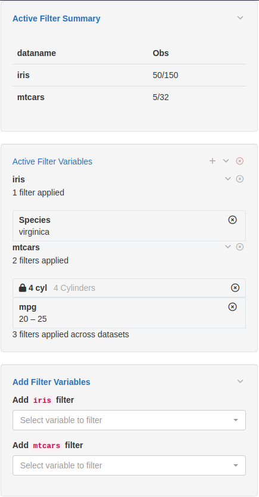

## Introduction

The `teal.slice` package provides a *filter panel* for `shiny` applications. 
`teal.slice` creates a filter panel module that allows for interactive filtering of data stored in `data.frame` and `MultiAssayExperiment` objects. 
It also displays filtered and unfiltered observation counts.

## Information for users of the filter panel in applications

The filter panel contains three panels:

1) The top panel displays the number of records (observations) that remain after the filters have been applied.
For relational data (where `join_keys` is specified), the number of unique subjects remaining in the filtered data set is also shown. 
2) The middle panel displays the current active filters and allows the user to change their state.
3) The bottom panel allows to add new filters on columns of the data sets in the app.

Note that multiple filters for the same data set are combined with the `AND` operator and it is not possible to apply hierarchical filters.

An example of the filter panel in use is shown in the image below. 
The `iris` data set has the 50 `versicolor` records removed, leaving 100 observations. 
The `mtcars` data set has filtered out all records other than those with `(gear = 3 or gear = 5) and (disp in [205, 295])`.  

```{r echo=FALSE, out.width='60%'}

```

Depending on the data type of the selected variable, different filters are shown, for example date pickers, range sliders, checkbox inputs.

For relational data (when `join_keys` are specified), filters specified on a parent data set (i.e. `ADSL`) will apply to all child data sets, whereas filters for a child data set can only be specified on columns not found in that data set's parent. 
For general relational data the filter panel treats each data set independently, irrespective of relationships between data sets.

The filter panel also supports filtering `MultiAssayExperiment` objects, where filters can be applied to the subject data, which is stored in the `colData` slot and accessed with `colData(MAE)`, as well as to experiments, which are stored in the `ExperimentList` slot and accessed with `MAE[["experiment name"]]`.


## Information for R developers using the filter panel

The example app below shows how to embed the filter panel inside a shiny application.

The filter panel is entirely contained within a `FilteredData` object. 
`FilteredData` is an `R6` class that stores data sets, tracks filter states, constructs and applies filter calls, and can output filtered data. 
It also contains `shiny` modules (both UI and server functions) that make up the panel itself.

In a `teal` application the `FilteredData` object (`datasets`) is created automatically by `teal`'s `init` function and filter panel components are automatically placed on the right hand side of the page.

Note that this example uses `shiny::dataTableOutput` and `shiny::renderDataTable`. 
This can lead to issues with Bootstrap, especially version 4.
We recommend using `DT::dataTableOutput` and `DT::renderDataTable` if possible. See the `shiny` and `DT` documentation for more information.

To facilitate communication with `FilteredData`, we provide the filter panel API. 
The example below uses the `set_filter_state` function to set state and the state is specified with `teal_slices` and `teal_slice` functions. 
For details please see the *Filter panel for developers* vignette.

```{r}
library(teal.slice)
library(shiny)

# create a FilteredData object
datasets <- init_filtered_data(
  list(
    iris = list(dataset = iris),
    mtcars = list(dataset = mtcars)
  )
)

# setting initial state
set_filter_state(
  datasets = datasets,
  filter = teal_slices(
    teal_slice(dataname = "iris", varname = "Species", selected = "virginica", keep_na = FALSE),
    teal_slice(dataname = "mtcars", id = "4 cyl", title = "4 Cylinders", expr = "cyl == 4"),
    teal_slice(dataname = "mtcars", varname = "mpg", selected = c(20.0, 25.0), keep_na = FALSE, keep_inf = FALSE),
    include_varnames = list(iris = c("Species", "Sepal.Length")),
    exclude_varnames = list(mtcars = "cyl"),
    count_type = "all",
    module_add = TRUE
  )
)

app <- shinyApp(
  ui = fluidPage(
    fluidRow(
      column(
        width = 9,
        tabsetPanel(
          tabPanel(title = "iris", dataTableOutput("iris_table")),
          tabPanel(title = "mtcars", dataTableOutput("mtcars_table"))
        )
      ),
      # ui for the filter panel
      column(width = 3, datasets$ui_filter_panel("filter_panel"))
    )
  ),
  server = function(input, output, session) {
    # this is the shiny server function for the filter panel and the datasets
    # object can now be used inside the application
    datasets$srv_filter_panel("filter_panel")

    # get the filtered datasets and put them inside reactives for analysis
    iris_filtered_data <- reactive(datasets$get_data(dataname = "iris", filtered = TRUE))
    mtcars_filtered_data <- reactive(datasets$get_data(dataname = "mtcars", filtered = TRUE))

    output$iris_table <- renderDataTable(iris_filtered_data())
    output$mtcars_table <- renderDataTable(mtcars_filtered_data())
  }
)
if (interactive()) {
  runApp(app)
}
```
